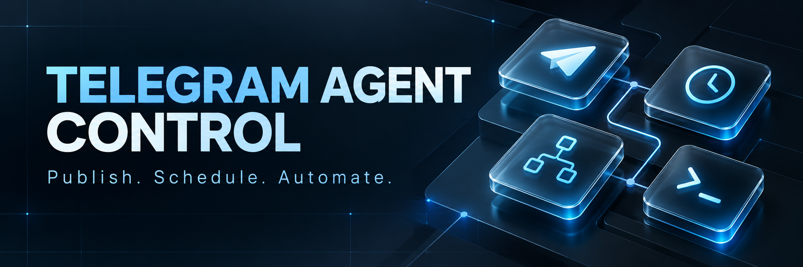
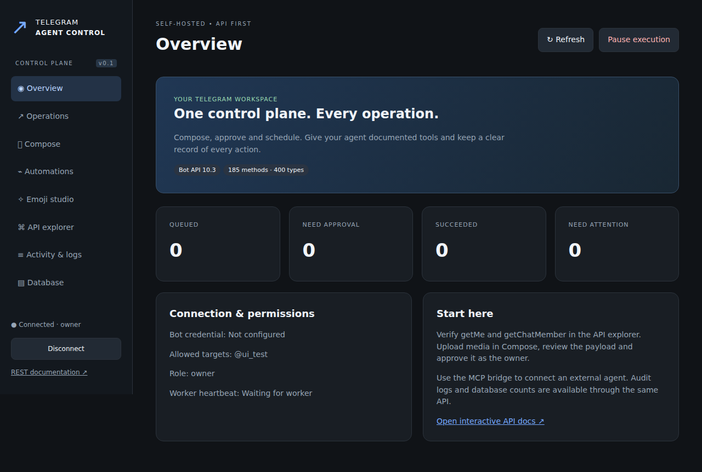
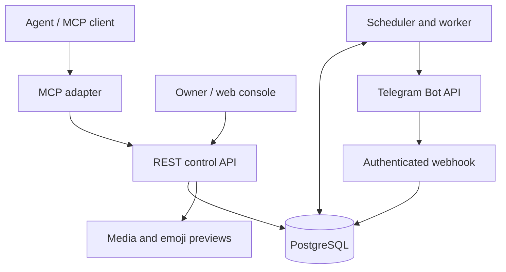

<p align="center"></p>

**Phone + desktop console:** sign in with your setup username/password, create scoped API keys in the web UI, or configure remote MCP OAuth. See [one setup, REST and MCP](docs/CONNECTIONS.md). A ChatGPT ZIP marked Desktop only still needs a registered cloud MCP connection; the server does not require Windows.


<p align="center">
  <a href="https://github.com/TIR3D4/Telegram-Agent-Control/actions/workflows/ci.yml"></a>
  
  
  <a href="LICENSE"></a>
</p>

<p align="center"><b>A self-hosted Telegram control plane for AI agents and channel operators.</b><br>Documented tools. Durable schedules. Explicit approval. Inspectable execution.</p>

<p align="center"><a href="docs/INSTALL.md">Install</a> · <a href="docs/API.md">API</a> · <a href="docs/AGENTS.md">Connect an agent</a> · <a href="docs/AUTOMATION.md">Automation</a> · <a href="docs/README.fa.md">راهنمای فارسی</a></p>

## Connect your AI — v0.4 review candidate

Talk inside **ChatGPT, Codex or Claude**. The console is for connections, drafts, approvals, schedules and diagnostics. Open **اتصال دستیارها** for separate REST, MCP, Codex, Claude and ChatGPT setup profiles, secret-free configuration exports and a real browser-to-MCP check. The existing internal chat is optional and is no longer the primary navigation entry.

[Workspace architecture, client setup and limits](docs/CONTROL_WORKSPACE.md) · [Exact v0.4 tests](docs/V04_TEST_RESULTS.md)

The visual composer supports text/photo, two URL buttons and schedules. Advanced Telegram methods retain the JSON/API editor. The private ChatGPT adapter source now supports bounded file-byte upload; deploying the VPS alone does not update that separately hosted adapter.

## What it does

Telegram Agent Control provides a web console, REST API, MCP bridge and persistent worker over a generated Telegram Bot API registry. An agent can discover a method, inspect its schema, prepare an operation and monitor the real result. The owner approves external writes. The server stores execution state, media, workflows and an audit trail in PostgreSQL. Version 0.2 adds 42 tested MCP tools, per-agent scopes and ownership, expiring approvals, OAuth resource verification, audited credential lifecycle and verified backups.

**Version 0.4.0 is a review candidate; production upgrade is a separate verified step.** It is not a claim that every Telegram method has been exercised against live Telegram. See [test evidence](docs/TEST_RESULTS.md) for the distinction between schema coverage, mocked transport tests and live acceptance.

| Capability | Included |
|---|---|
| Bot API coverage | **185 methods / 400 types**, generated from official Bot API 10.3 documentation; nested JSON Schema and selected semantic checks |
| Publishing | Text, photos, video, audio, documents, albums, native Rich Message slideshows and every other registered method, subject to Telegram's destination restrictions |
| Channel controls | Edit, delete, pin/unpin, invite/member/chat management through the same operation gateway |
| Schedules | One-time operation timestamps; bounded cron and event-driven workflows; persisted delay steps |
| Automation | Publish → pin → delayed unpin, previous-step result references, pause/resume, immutable approval of workflow content |
| Agent access | 42 MCP tools, shared REST/OpenAPI policies, scoped expiring credentials, optional external-issuer OAuth; owner stays outside MCP |
| Emoji studio | Pack import, original files, WebP/TGS/WebM previews, visual labels, reviewed role bindings, image content returned to MCP clients |
| Observability | Correlated redacted audit/logs, filtered search, queue metrics, worker freshness, safe DB/backup status and optional OTLP spans |
| Operations | Docker Compose, HTTPS, terminal menu, verified backup/restore, paused upgrades, controlled rollback, safe uninstall |

## Quick start

Use a Linux VPS with Docker Engine and Compose v2. A practical starting allocation is **2 vCPU, 2–4 GB RAM and 20 GB storage**; media and retention determine disk growth. This is an initial sizing estimate, not a benchmark.

```bash
git clone --branch engineering/unified-control-v0.4 https://github.com/TIR3D4/Telegram-Agent-Control.git
cd Telegram-Agent-Control
./scripts/install.sh
```

The installer prompts for the bot token without echoing it, allowed destinations and an optional HTTPS hostname. It generates bootstrap secrets in a local `.env` with mode `0600`, disables legacy shared agent keys on fresh installs, builds the app, migrates PostgreSQL and starts the API and worker. It then asks for your console username/password once and configures managed OAuth when an HTTPS domain is set. Docker can be installed through the official installer after an explicit terminal prompt.

With a configured domain and working DNS, use `https://your-domain`. Without a domain the console binds to `127.0.0.1:8787`; connect with an SSH tunnel:

```bash
ssh -L 8787:127.0.0.1:8787 user@your-server
```

Open your HTTPS domain (or `http://127.0.0.1:8787` locally) and sign in with your setup username/password. Open **Connect an AI** to choose REST or remote MCP and issue a finite scoped API credential in **Agent permissions**. The owner key is retained only as a private recovery/advanced credential. Start with `getMe` and `getChatMember`, then a **test channel**.

<details>
<summary>Console screenshot (v0.1 local test workspace; current screenshots are CI artifacts)</summary>



</details>

## Approval and execution

1. Upload media and prepare a method payload, or let an agent do it.
2. Schema validation catches structural errors and selected cross-field rules.
3. Read requests queue immediately. External writes become drafts.
4. The owner approves the **exact content, attachments and schedule hash**.
5. A worker claims the operation and records Telegram's result.
6. Read status, message links and the audit trail through the API or console.

Approvals expire and bind the exact schedule. Changing an approved draft revokes approval. Requests use an idempotency key. A transport timeout after a possible send becomes `uncertain` and is not blindly resent. Telegram does not offer a general client idempotency key; this application does not promise exactly-once external delivery.

## Architecture



The worker executes deterministic schedules without an LLM call. An external agent brings its own model and connects through MCP or REST. This release does not include a hosted LLM subscription or an autonomous model runtime.

## Operate the installation

```bash
./scripts/tacctl             # Interactive terminal menu
./scripts/tacctl doctor      # Full read-only installation diagnosis + private report
./scripts/tacctl logs        # Structured API/worker logs
./scripts/tacctl backup      # Consistent DB + media snapshot
./scripts/tacctl update      # Backup, fast-forward, build, migrate, restart
./scripts/tacctl uninstall   # Remove services, preserve persistent data
```

See [one-command diagnostics](docs/DIAGNOSTICS.md) for checks, safe reports, scoped MCP testing and exit codes.

`restore` pauses execution until the owner reviews outstanding operations. `purge` separately asks for a typed confirmation before deleting database/media volumes. See [operations](docs/OPERATIONS.md).

## Documentation

- [Installation and first-run checks](docs/INSTALL.md)
- [REST API and request examples](docs/API.md)
- [MCP setup](docs/MCP_SETUP.md), [ChatGPT](docs/CHATGPT_CONNECTION.md), [Codex](docs/CODEX_CONNECTION.md)
- [42 agent tools and schemas](docs/AGENT_TOOLS.md), [permissions](docs/PERMISSIONS.md), [security](docs/SECURITY.md)
- [Scheduling and automation](docs/AUTOMATION.md)
- [Emoji catalog and visual selection](docs/EMOJI.md)
- [Database, observability and recovery](docs/OPERATIONS.md)
- [Architecture and design decisions](docs/ARCHITECTURE.md)
- [Capability matrix](docs/CAPABILITY_MATRIX.md), [testing](docs/TESTING.md), [exact results](docs/TEST_RESULTS.md)
- [Implementation report](docs/IMPLEMENTATION_REPORT.md) and [known limitations](docs/KNOWN_LIMITATIONS.md)
- [Upgrade/rollback](docs/UPGRADE.md), [backup/restore](docs/BACKUP_RESTORE.md), [observability](docs/OBSERVABILITY.md)
- [15-repository source audit](docs/RESEARCH_COMPARISON.md), [gap analysis](docs/GAP_ANALYSIS.md) and [implementation plan](docs/IMPLEMENTATION_PLAN.md)
- [Persian quick start](docs/README.fa.md)

At runtime: `/docs`, `/redoc`, `/openapi.json`; method-specific contracts: `/v1/methods/{name}` and type references: `/v1/types/{name}`.

## Development

Moving development into Codex: [ready-to-use handoff and environment setup](docs/CODEX_HANDOFF.md). The pinned context optimizer is included; production credentials are not.

```bash
python3.12 -m venv .venv
. .venv/bin/activate
pip install -r requirements.lock
pip install --no-deps -e .
# Set distinct TAC_OWNER_KEY and TAC_AGENT_KEY (32+ characters), plus allowed chats.
alembic upgrade head
tac serve
# Another terminal:
tac worker
pytest -q
```

SQLite is available for single-worker development. **PostgreSQL is required for production and concurrent workers.** Regenerate the registry intentionally with `python scripts/sync_api.py`; review the diff and run tests before updating the pinned API version.

## Scope and limits

- Bot API coverage does not grant Telegram permissions. Channel/private/group/business restrictions still apply.
- Premium emoji eligibility in channel posts differs from owner Premium eligibility in private/group chats.
- Telegram limits message deletion; arbitrary channel history retrieval is not part of general Bot API access. The application can inspect records and updates it has stored.
- Rendering in old clients, limits expressed only in Telegram prose, and method-specific live behavior require live verification.
- This is independent software, not an official Telegram product. MTProto account automation and Telegram Ads are separate APIs and are outside this release.

## Contributing

Read [CONTRIBUTING.md](CONTRIBUTING.md). Keep changes small, include behavior tests for execution or security changes, and update the matching documentation. Never include bot tokens, `.env` files, customer exports or production media in a pull request.

MIT licensed. See [LICENSE](LICENSE) and [SECURITY.md](SECURITY.md).
