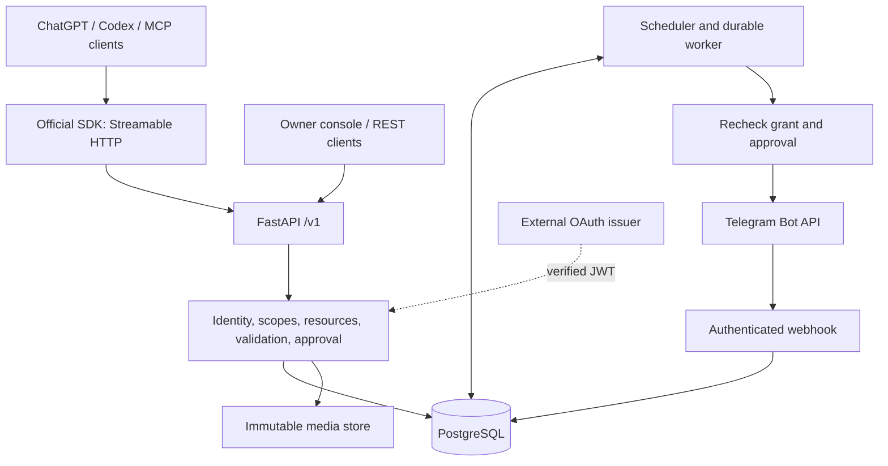
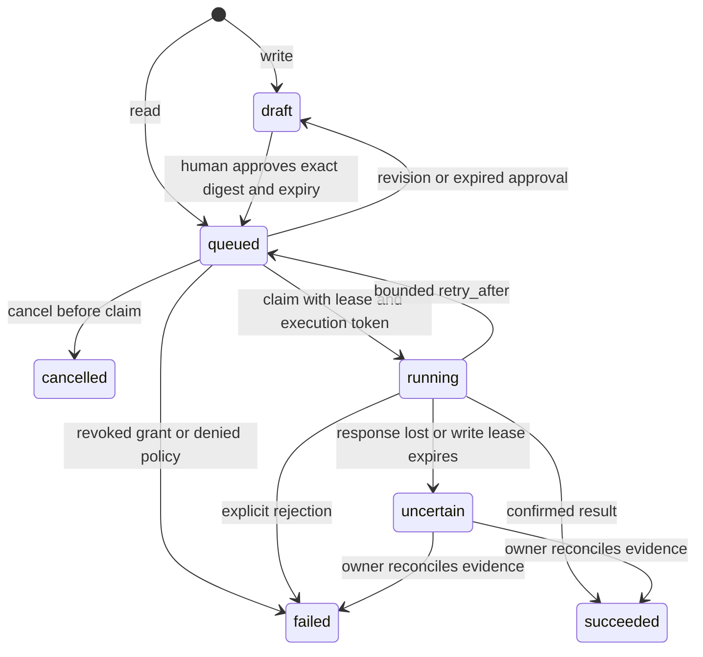

# Architecture — v0.2

An API-first modular monolith. PostgreSQL is the durable control plane; a separate worker process executes approved operations. There is no Redis, broker, embedded model or second workflow framework.

## Module responsibilities

| Module | Responsibility |
|---|---|
| `security`, `oauth`, `gateway` | Authentication, resource-server JWT validation, role/scope/method/channel intersection, ownership, quotas |
| `operations`, `workflows` | Exact immutable fingerprints, approvals, schedules, persistent workflow runs |
| `api`, `control_api` | Typed REST interfaces and owner operations; no direct external publishing |
| `mcp_server`, `remote_mcp` | Official SDK transport, typed discovery and caller-preserving REST adapter |
| `registry`, `telegram` | Pinned official schemas, selected semantic validation, JSON/multipart upstream transport |
| `worker` | PostgreSQL row claims, leases, fenced completion, retry limits, policy revalidation |
| `media` | Immutable uploads and shared visual emoji catalog; preview downloads are explicit read-only Telegram calls |
| `db`, `maintenance` | Transactions, versioned schema, retention and operator recovery |
| `observability`, `logging_setup` | Correlated redacted events and optional OpenTelemetry |

MCP is an adapter over the same authenticated REST boundary. A per-request context carries the caller credential into SDK worker threads; no shared elevated credential replaces it. Stdio uses the configured agent key. Both transports converge on the same services, database state machine and authorization. The console has no separate publishing authority.

## Execution states

Approval binds method, payload, immutable asset IDs and schedule. Workflows bind steps, trigger, timezone and maximum runs, with a finite approval period. Changing a plan removes consent. Revoking an agent prevents subsequent claims; a request already in flight cannot be recalled.

Application idempotency uses a unique key and payload comparison. A concurrent collision returns 409 for retry with the same key. This prevents duplicate records, not exactly-once Telegram delivery. Lost responses require reconciliation. Multi-step workflows preserve completed steps and halt on failure/uncertainty; no automatic compensating deletion is assumed.

## Data and deployment

Operations, workflow runs, grants, quotas, audit and updates persist in PostgreSQL. Media bytes are in a volume; ownership and checksums are in the database. SQLAlchemy sessions are short-lived per transaction; Telegram I/O occurs outside the claim transaction. PostgreSQL `FOR UPDATE SKIP LOCKED` permits concurrent workers. SQLite is single-worker development only.

Keep `/v1` for existing clients; `/api/v1` is not an alias. `/mcp/`, `/openapi.json`, `/health/live` and `/health/ready` have distinct roles. Readiness checks database access, not Telegram delivery or worker freshness; inspect `/v1/metrics` for the worker.

One configured bot account is retained. MTProto user sessions and a model-driven internal runtime are separate integrations, not simulated features. The deterministic runtime supports once/cron/update triggers, delays, cancellation, finite authorization and restart recovery without an LLM subscription.

See [research](RESEARCH_COMPARISON.md), [ADRs](adr/0001-control-gateway.md) and [limits](KNOWN_LIMITATIONS.md).

## Optional in-panel mobile chat

See [mobile assistant ADR](MOBILE_ASSISTANT_RESEARCH.md). Owner-authenticated chat routes enqueue persistent chat turns. A bounded worker thread calls the configured HTTPS provider; explicit tools re-enter REST with a server-held scoped agent bearer. No human session or provider secret is included in model context. Independent owner approval is performed in the existing operation dialog. Development proposals have no GitHub/server execution permission. No additional chat platform or mcpo container is required.
