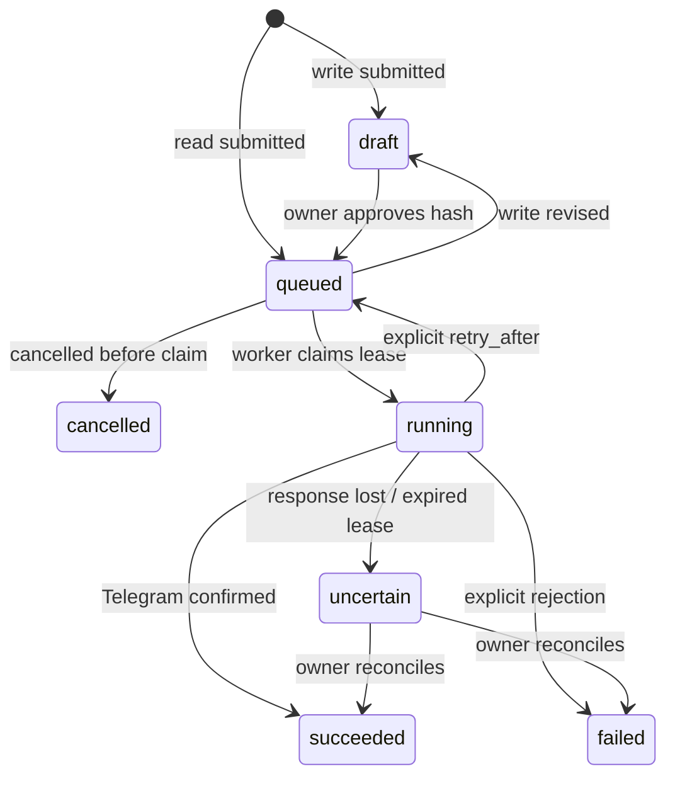

# Architecture

## Boundaries

`registry.py` loads a checked-in snapshot generated by `scripts/sync_api.py`. `telegram.py` handles transport only. `operations.py` owns validation, target policy, content fingerprints and approval. `worker.py` owns claim/lease/result transitions. `workflows.py` creates dependent operations from frozen plans. REST, console and MCP share this state machine.

The database is the source of truth. No in-memory timer is required for durable work. Scheduling runs inside workers under row locks. API requests do not send external writes directly. Read operations also pass through the worker, except the explicit read-only media preview download path.

## State machine

Idempotency is enforced by a unique application key and content comparison. Approval binds method, payload, attachment IDs and run timestamp. External exactly-once delivery cannot be guaranteed across a lost Telegram response. Uncertain operations require reconciliation.

## API versioning

Bot API 10.3 is pinned in the generated registry. The source URL and HTML SHA-256 are stored. Every discovered method has an input schema and each referenced type is preserved. The source parser fails when a field type cannot be resolved. It does not guess future fields at runtime.

Updating the registry is a reviewed source change: fetch official docs, regenerate, inspect diffs, update semantic rules, run schema and transport tests, then verify changed features in a test channel. Version coverage is different from live eligibility.

## Credentials and capabilities

Owner, agent and reader keys are distinct. The MCP process only uses the agent credential; no approval tool is provided. All registered methods can be submitted, including global bot settings, but writes require owner review. Chat-targeted requests must match the configured destination allowlist. A reviewed workflow is a bounded authorization grant for its exact frozen outputs and timing.

The service does not execute SQL or shell commands from model output. Agent database inspection happens through typed endpoints. Bot tokens stay in server configuration and are masked from API output and logs.
