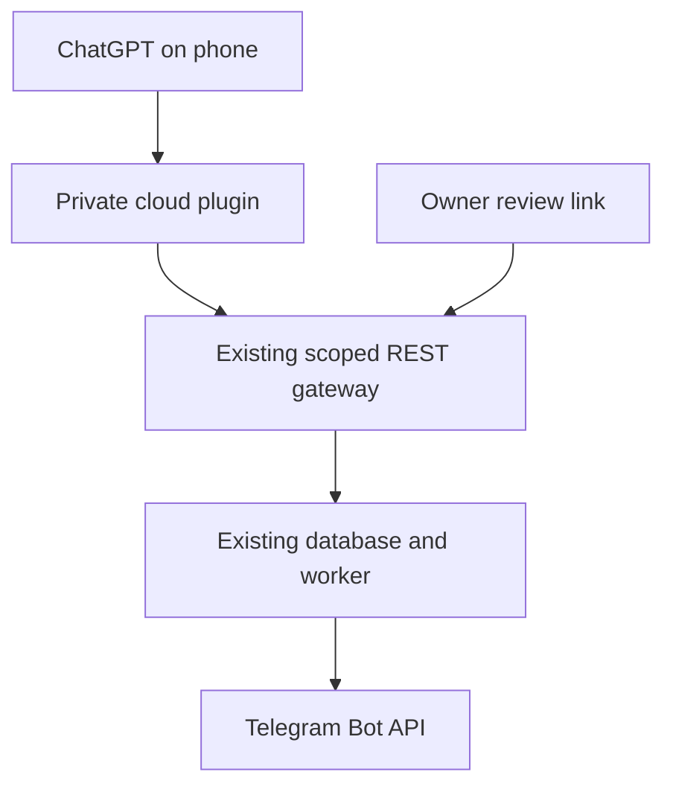

# ChatGPT-first Telegram control — correction of scope

Reviewed 2026-10-10. Baseline: `39f35a27e5c0fa4dfd07cf2457b6aa2431da455b`.

## Live activation and edge-runtime repair (2026-10-10)

Owner-private publication of version 1 succeeded after owner authorization; Sites returned a canonical plugin. Installation and a successful scoped gateway call are still unverified. The owner encountered a connection-form failure. Worker logs showed HTTP 400 within 2–3 ms; source inspection and an actual local workerd reproduction identified `redirect: "error"` as unsupported by this runtime. Prior Node mock tests did not catch this incompatibility.

The connector now uses `redirect: "manual"` and explicitly refuses 3xx responses for both the gateway and image download, preserving credential isolation and SSRF constraints. Failed reads no longer imply a Telegram operation might have been submitted. Added a credential-free readiness probe at `/api/gateway-health`, behind private Sites access, which only requests the configured origin's readiness URL and returns bounded status fields.

Validation: 15 existing Node tests plus 1 actual Miniflare/workerd regression test passed (16 total). The runtime test intercepts outbound HTTP, verifies success, rejects gateway/image redirects without following them, and verifies image requests have no agent bearer. No real key or Telegram call is involved. TypeScript check passed. Run the runtime test in the full Sites starter with Wrangler/Miniflare installed: `node --test tests/edge-runtime.mjs`. Live gateway readiness and scoped authentication remain separate checks.

## Acceptance means the owner works in ChatGPT

The owner's desired loop is: discuss a daily plan in ChatGPT, create/correct text and images there, prepare exact drafts/schedules on TAC, independently approve, and obtain actual delivery status/message links. A separate provider-funded chat inside the panel is not acceptance of that requirement. Keep its existing data/config intact, but do not require it or continue developing it for this goal.

The same pre-existing gateway, PostgreSQL, queue, worker, approval digest, Telegram credentials and OAuth remain authoritative. This change adds a transport adapter, not another publisher. It neither migrates existing data nor installs another model runtime.

## Connection decision and evidence

| Route | Evidence | Decision |
|---|---|---|
| Remote MCP registered directly in ChatGPT | Official plugin quickstart requires Add custom MCP server. Owner reports this UI is absent and uploaded mcp.json is Desktop only. | Preserve direct MCP, but do not claim a manifest edit unlocks account/mobile access. |
| GPT Actions | Official REST/OpenAPI/auth/file documentation exists. Current official migration guide describes custom GPT retirement; account availability is unknown. | Not selected as a new long-term dependency. Earlier suggestion was provisional, not a verified account path. |
| Sites-provisioned private cloud plugin | Installed Plugin Creator and Sites capability documents specify private App/plugin provisioning on publication, canonical plugin ID from get_site, and Sites-authenticated caller identity on /mcp. | Build a minimal cloud adapter. Registration of an unpublished Site is verified; publication, installation and real invocation are NOT yet verified. |
| LibreChat/Open WebUI/in-panel chat | See existing pinned code audit in MOBILE_ASSISTANT_RESEARCH.md. | Different chat surface; not the requested solution. No further chat stack added. |

Official sources read:
- https://developers.openai.com/plugins/quickstart
- https://learn.chatgpt.com/docs/plugins
- https://learn.chatgpt.com/docs/migrate-custom-gpts
- https://developers.openai.com/api/docs/actions/introduction
- https://developers.openai.com/api/docs/actions/authentication
- https://developers.openai.com/api/docs/actions/production
- https://developers.openai.com/api/docs/actions/sending-files

The current execution environment still returns HTTP 200 with **HTML Site Unavailable** for the origin's readiness URL. This is a failed origin access check, not JSON readiness. An integration deployed on another supported host has a separate egress path; its access must be tested there. This design is not a claim to remove current environment or account restrictions.

## Related source inspections (no code copied)

| Source at immutable commit | License and actual files read | Applicability |
|---|---|---|
| `nextster/telegram-bridge@7755e007cf15727be3eb516620439e78fafcc6fc` | MIT; internal/mcpserver/server.go, principal_test.go, internal/oauth/oauth.go, LICENSE | Uses official Go SDK StreamableHTTP transport and token->user account resolution; tests cross-user isolation. Useful for principal preservation. It manages Telegram user accounts, not our existing bot approval queue; replacing TAC would broaden access and still not register this account's plugin. |
| `timoncool/telegram-api-mcp@bce4b366f2d6867f688ed82522695c843389641c` | MIT; src/server.ts, telegram-client.ts, LICENSE | Schema discovery and method registry; stdio transport and direct Telegram execution including general method calling. Does not solve cloud registration or independent owner approval. Keep our fixed action profile and gateway. |

The previous LibreChat/Open WebUI/mcpo pins and code findings remain in MOBILE_ASSISTANT_RESEARCH.md. No additional framework is justified by the actual connection gap. Stars/readme marketing are not used as production evidence. CPU/RAM benchmarks of these references were not run.

## Implemented contract

Source: `integrations/chatgpt-cloud/`. Twelve tools: connection_status, inspect_system, method_schema, prepare_operation, operation_status, list_operations, revise_operation, cancel_operation, prepare_content_plan, list_media, import_chatgpt_image, search_emoji.

- Fixed HTTPS TAC origin; scoped user-bound bearer, not bot token/owner login.
- Sites supplies verified user identity. Store encrypted grant per identity (AES-GCM, user as authenticated additional data). A shared visitor never inherits another user's key.
- No key/config/approval/deployment tool. Browser setup verifies dedicated agent identity, same-origin checks for state changes, never returns saved secrets.
- Existing REST remains responsible for scopes, destination allowlist, quota, expiry, revocation, authorization and audit. Reads and drafts are never misreported as deliveries.
- Draft/edit/delete/pin requests all pass through the existing operation state machine; no new send route.
- Content plans use 1–10 independent keyed operations with explicit timezone offsets. They stop after first unconfirmed request. No batch approval, no atomic batch promise, no implicit retries.
- Owner review links preserve exact operation ID through login. The console displays schedule in Tehran time, authenticated attached images, and exact digest for the existing approval POST. GET/login never approves.
- No separate OpenAI API key, provider billing, model execution or scheduler in the connector. ChatGPT plan/host usage remains subject to its own terms; no claim that hosting/service use has no cost.
- Signed image links supported only when actually supplied by the host. No sandbox-path download fiction. Private image upload is an explicit fallback, not an automatic success claim.

## Tests actually run for this candidate

- `node --test integrations/chatgpt-cloud/tests/connector.test.mjs`: **15 passed** (mocked D1 and HTTP; includes protocol discovery/calls, cross-user encryption isolation, owner/legacy-key rejection, absent/unknown tools, scheduling and idempotency propagation, uncertain outcomes, partial plans, redaction, quota/auth failures, SSRF restrictions and stream limits).
- `.venv/bin/python -m pytest -q tests/test_governance.py tests/test_operations.py tests/test_mobile_operations.py tests/test_workflows.py`: **38 passed, 1 skipped** (PostgreSQL-only test skipped locally).
- `.venv/bin/python -m pytest -q tests/test_lifecycle_hardening.py tests/test_web_connections.py`: **24 passed**.
- `npm test -- --project=chromium`: **7 passed**; includes exact review URL after login at 390x844, draft still unapproved. Screenshot inspected. This is Chromium emulation, not physical Safari.
- `ruff check tac scripts tests`, `ruff format --check tac scripts tests`: passed.
- Sites starter `tsc --noEmit`: passed. Sites Vinext production build: passed (emits route-classification informational warning).

No real Telegram publishing, no live provider call and no production server upgrade were performed. Existing successful getMe supplied by the owner proves the earlier in-panel assistant grant worked; it is NOT proof of this new cloud connector.

## Activation gate (do not skip)

The owner previously required explicit authorization for production deployment. Every Sites deployment URL is production, including owner-private Sites. Therefore the candidate is prepared/saved first; publish only after the owner's approval. Do not regenerate existing secrets, merge default branches, or upgrade the VPS just to claim progress.

After approved publication:
1. Set server-side TAC origin and randomly generated secret vault key in Sites runtime configuration, preserve private audience.
2. Inspect actual plugin provisioning; use its returned canonical plugin ID (never an invented ID or another ZIP).
3. Owner connects a dedicated finite OPERATE grant through the private browser form, not conversation text.
4. Execute read-only status/getMe through the actual ChatGPT plugin, verify resulting operation identity and result.
5. Ask the owner to verify appearance/use on iPhone. Test image availability from the actual host.
6. Only then consider the small VPS UI upgrade for direct exact review links. On old versions the console operations list still permits manual independent review.
7. Test an explicitly approved test-channel post/schedule before production content.

**Unverified:** Sites-hosted runtime/D1 migration/identity forwarding, origin egress from Sites, canonical plugin registration/use in this account, iOS availability, native generated-image transfer, physical Safari, and live publication. These are acceptance gates, not optional polish. A successful build is not a completed end-to-end connection.

## Development and deployment stay separate

The owner's clarified software-project-management request is covered in [the pinned source comparison and decision](CHATGPT_PROJECT_MANAGEMENT_RESEARCH.md), including Cloud Harness, chatgpt-web-oauth-mcp, dockerMCP-ChatGPT and coding-tools-mcp.

GitHub development remains in reviewable branches/PRs; the Telegram plugin cannot modify code or deploy. Optional server UI upgrade uses the existing pinned updater with backups/migration inspection/readiness/worker checks, and remains paused until owner review. No automatic database downgrade. Existing OAuth, users, database and secrets are unchanged by these source changes.

## Expanded GitHub search requested by owner

Four more actual repositories were cloned and inspected. This did not change the key constraint: hosting an MCP endpoint does not register it in the owner's ChatGPT account.

| Repository and inspected commit | Findings from source | Decision |
|---|---|---|
| [d8rt8v/chatgpt-to-telegram-mcp](https://github.com/d8rt8v/chatgpt-to-telegram-mcp/tree/6d9fe2a9b4155359f31e03d7a19432027029ede4) | MIT; `src/index.js`, `telegram.js`, `storage.js`, `dedupe.js`, OAuth handler inspected. Worker OAuth + D1, tools for text sending and 48-hour history/deduplication. Sends directly to a fixed bot channel. The error handler releases its reservation on any send exception; network uncertainty therefore warrants more care than copying that pattern. | Closest narrow example of ChatGPT-to-channel publishing, but no existing TAC owner approval/media/worker integration. Reuse concept of thin remote adapter; do not replace gateway or blindly copy retry semantics. |
| [mcp-telegram/mcp-telegram-cloud](https://github.com/mcp-telegram/mcp-telegram-cloud/tree/efd849829a4b3278173899e50ba70faea7a57004) | MIT; `mcp-handler.ts`, `destructive-guard.ts`, `crypto.ts` inspected. Session-to-user mapping, encrypted GramJS sessions, user opt-in toggle + daily destructive quota. README explicitly says directory listing in progress and requires manual custom MCP until then. | Stronger remote hosting example; opt-in toggle is not our per-operation exact approval. Requires user Telegram account sessions and still relies on host registration. |
| [mcp-telegram/mcp-telegram](https://github.com/mcp-telegram/mcp-telegram/tree/69bfe549fbb307168207b3590e86095237753bac) | Companion source tree and `docs/platforms/chatgpt.md` inspected. Documented local command/npx desktop setup, redirects to cloud variant. No runtime source audit beyond the cloud implementation above. | Does not supply a demonstrated phone account registration route. |
| [Upload-Post/upload-post-mcp](https://github.com/Upload-Post/upload-post-mcp/tree/5d23afff437a64409b08bdae86c32b9523a7f8dd) | MIT; `src/client.ts`, `src/tools/schedule.ts`, source tree inspected. SDK/HTTP facade to the commercial Upload-Post API, typed schedule list/cancel/edit tools. | Good comparable publishing/schedule workflow, but adds a new provider/account instead of using the already installed TAC backend. No evidence it fixes this account's missing registration. |

An actual available-plugin search for `Telegram` returned no results in this account's tool catalog. That search is not exhaustive and does not prove no Telegram integration exists anywhere. None of the reference services was authenticated, paid for, deployed, or given the owner's secrets. Reference tests were not run; source observations are not full security certifications.
