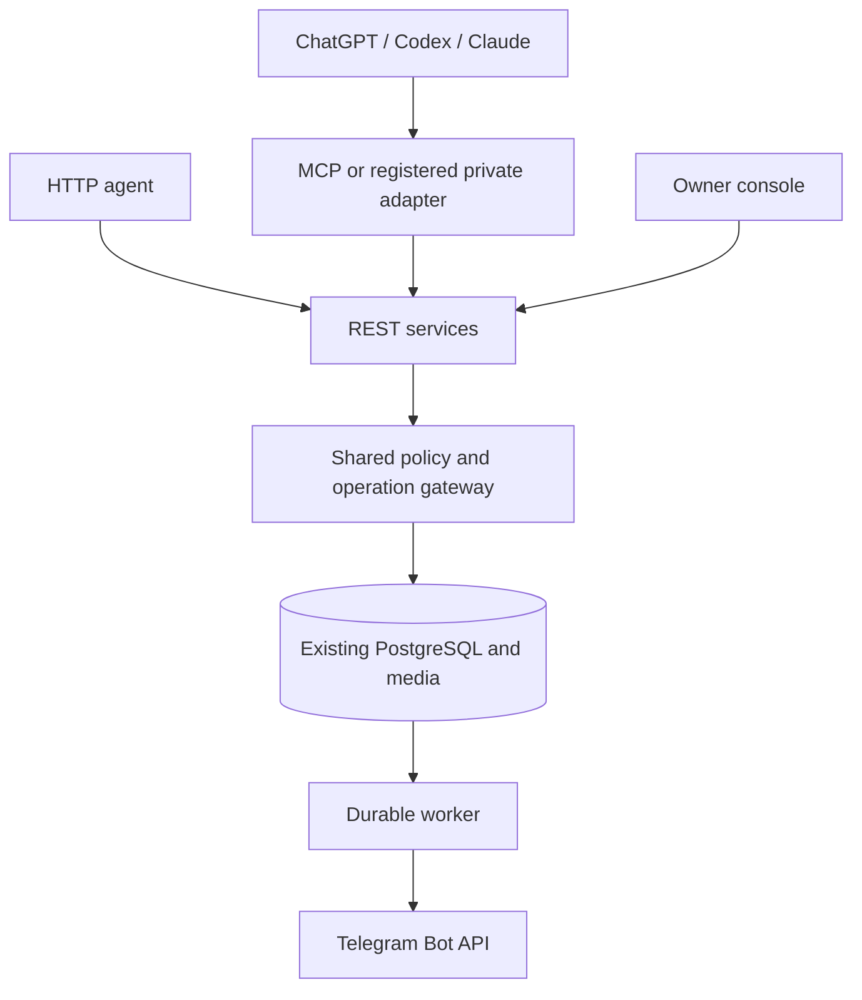

# Unified control workspace — v0.4

## Product boundary

Talk in **ChatGPT, Codex or Claude**. TAC is the Telegram control server and operator console, not a replacement chat product. REST and MCP share identity, permissions, quotas, media ownership, approval, durable operation state and audit. Client recipes are adapters, not separate Telegram implementations.

No schema migration is added by v0.4. Existing users, OAuth clients, grants, sessions, media, schedules and optional internal-assistant data remain intact. The old assistant is under **optional tools**, not the primary workflow. It remains callable for installations already using it.

## Connection center

`GET /v1/connections` remains owner-only and now returns `profiles`, `media`, `verification=configuration_only` and the existing fields. Generated configurations contain placeholders/environment references, never credentials.

| UI section | Real interface | Secret location | Host-specific limitation |
|---|---|---|---|
| REST API | `/v1`, `/openapi.json`, `/agent-guide` | Host HTTP tool secret store | A link pasted in chat cannot add an HTTP execution tool |
| MCP | `/mcp/`, Streamable HTTP | Scoped bearer or configured OAuth | Client must implement MCP; URL alone is not a connection |
| Codex | Remote MCP; exported TOML | `TAC_TOKEN` in CLI/IDE runtime environment | CLI config does not register ChatGPT mobile or hosted Cloud |
| Claude | Remote connector or Claude Code MCP | Request-header secret store / OAuth; `TAC_TOKEN` for Code | Web/mobile connection comes from Anthropic; Code config is separate |
| ChatGPT | Registered remote connection or existing private adapter | OAuth / encrypted scoped grant in adapter | Account must expose registration; ZIP and DNS cannot unlock that feature |

Codex fragment goes into `~/.codex/config.toml`. Claude Code fragment goes into `.mcp.json`; `${TAC_TOKEN}` is an environment reference. Set the secret outside chat/source control. These are code-generated client recipes, **not evidence of a successful invocation in that product**.

The console test sends authenticated GET `/v1/system`, MCP `initialize` and `tools/list` from the owner's browser, using the entered scoped token and `credentials: omit`. It clears the field immediately, rejects owner credentials, has a 20-second timeout per request, sends no Telegram action, and distinguishes its result from cloud/client connectivity. A final `inspect_system` invocation must occur inside the selected AI client.

Managed OAuth advanced settings retain exact HTTPS callbacks, PKCE, and subject-bound grants. DCR/CIMD interoperability is not claimed. Claude Code's localhost OAuth callback is not accepted by the existing HTTPS-only registration form; use its scoped Bearer profile. No account password is given to an agent.

## Daily workflow

1. Select the connection in the AI conversation and inspect actual scope/capabilities.
2. Upload real media bytes or reuse an authorized asset. Do not invent URLs.
3. Prepare one operation with a stable idempotency key and explicit schedule offset.
4. Review the exact caption, media and schedule in the owner console.
5. Worker executes; the agent polls status and returns the confirmed Telegram link.

The visual composer handles text or a single photo, two URL buttons and one-time scheduling. Rich slideshows, albums, other media and specialized methods remain in the advanced JSON/API editor. The main operations view has status filters and cursor-based older/newer navigation (30 records per page). The details dialog displays readable content and keeps complete parameters available for independent review.

A saved composer retains its operation ID; clicking again opens the existing draft. A network error retains the same idempotency key. A changed payload after uncertain submission can return a conflict, requiring inspection instead of duplicate delivery.

## Media transport

- REST `POST /v1/assets`: multipart file upload, existing configured size limit.
- Main MCP `upload_media`: existing Base64 transport, 1 MiB decoded limit.
- Private ChatGPT adapter: new `upload_media` forwards actual Base64 bytes to `/v1/assets/encoded`, with validation and the original scoped credential. No publishing or approval occurs.
- Adapter `type_schema`: fetch one nested Telegram type; `method_schema` requests compact schemas rather than a huge response that is omitted.
- Larger files use multipart. Base64 is a bounded fallback, not suitable for large videos. A tool definition cannot itself grant the model access to host-local image bytes; the host needs a file tool or a genuine download link. Adapter source must be deployed separately before its new tools are live.

## Console design

Persian RTL operator shell, quiet light content surface, dark navigation, compact horizontally scrollable mobile navigation, status cards, dedicated client tabs, copying/downloading secret-free connection configs, visual photo composer, readable independent review and responsive operation cards. Existing advanced screens and API IDs stay intact. Some advanced forms remain English/JSON; complete translation and visual builders for every Telegram method are not claimed.

## Development and deployment authority

Telegram access is separate from repository and host administration. No shell, SQL, root or deploy tool is added to MCP. GitHub review branches use independent developer credentials. VPS upgrades use the pinned local operator script, which backs up app DB/media/config and OAuth DB, preserves live OAuth/Caddy settings, checks migrations, readiness and worker heartbeat, writes a private failure report and leaves execution paused.

This release does **not** add a web-facing root updater. A secure host deployment executor is still required for direct upgrades from an agent/UI. Do not give the Telegram grant root authority to avoid one console step. Existing maintenance approvals and diagnostics remain usable in the console.

## Sources checked 2026-10-10

- [OpenAI MCP configuration](https://learn.chatgpt.com/docs/extend/mcp?surface=cli): remote URL, bearer environment variable and timeouts.
- [OpenAI connect/test a plugin](https://developers.openai.com/plugins/deploy/connect-chatgpt): registered host connection; availability is not controlled by TAC.
- [Claude Code MCP](https://code.claude.com/docs/en/mcp): HTTP transport, configuration scope, environment expansion and OAuth.
- [Claude remote connectors](https://support.claude.com/en/articles/11175166-get-started-with-custom-connectors-using-remote-mcp): cloud network path, request headers, custom registration and OAuth choices.

Client documentation evolves; inspect current UI and run the actual read-only probe before asserting compatibility.
